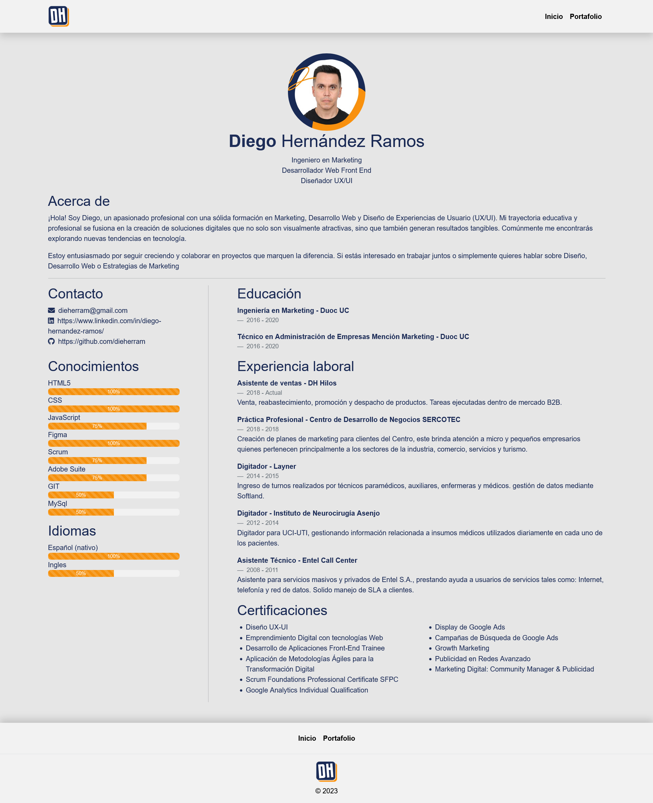
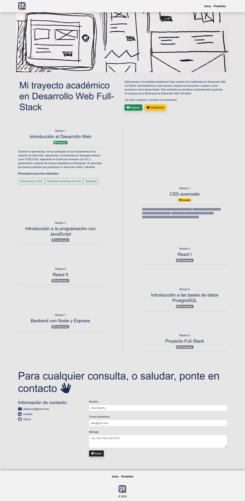

# Prueba - Desarrollo de Portafolio 🚀

## Descripción del Desafío 🌐

En este emocionante desafío, he actualizado mi curriculum y portafolio, haciéndolos accesibles a través de GitHub Pages. Esta iniciativa integra todos los conocimientos adquiridos hasta ahora.

## Resultado Final 🎉

¡Puedes ver el resultado final de mi proyecto accediendo a [mi portafolio](https://dieherram.github.io/)!

¡Aquí hay imagenes mi proyecto!

### Index (CV)

### Portafolio

## Estructura del Proyecto 📂

### 1. CV utilizando HTML y CSS

- Barra de navegación.
- Enlace al portafolio.
- Sección de educación.
- Sección de experiencia.
- Footer.

### 2. Página para el Portafolio

Dentro de mi portafolio, he creado una sección dedicada a mostrar mi trayectoria académica y los módulos que he cursado en el Desarrollo Web Full-Stack. Esta sección se encuentra estructurada de la siguiente manera:

- **Navbar:** La barra de navegación facilita la transición entre las distintas secciones de la página, proporcionando una experiencia de usuario intuitiva.

- **Header:** La sección de encabezado presenta una imagen de fondo evocadora y un mensaje atractivo que invita a explorar mi trayecto académico en Desarrollo Web Full-Stack. También incluye botones que facilitan la navegación hacia las secciones relevantes.

- **Main:** La parte principal del portafolio está dividida en módulos correspondientes a los diferentes temas que he abordado. Cada módulo incluye información detallada, como el nombre del módulo, el estado actual (finalizado, cursando, próximamente), una breve descripción y, en algunos casos, proyectos destacados asociados.

  - **Modalidades de Presentación de Proyectos:** Para algunos proyectos específicos, he incorporado una presentación detallada mediante ventanas modales. Estas ventanas emergentes incluyen una vista previa del proyecto, información clave y enlaces a los repositorios de GitHub para obtener más detalles.

  - **Visualización Responsiva:** La página se adapta de manera efectiva a diferentes dispositivos, garantizando una experiencia de usuario consistente.

- **Form:** La sección de formulario proporciona a los visitantes la posibilidad de ponerse en contacto conmigo. Incluye campos para el nombre, correo electrónico y un área para el mensaje. Un botón de envío permite a los usuarios enviar sus consultas de manera sencilla.

- **Footer:** El pie de página presenta enlaces de navegación adicionales y mi logotipo. También contiene información de derechos de autor y enlaces a mis perfiles en redes sociales.

Este diseño, implementado utilizando HTML, CSS y Bootstrap, busca destacar de manera clara y estructurada mi viaje académico en el campo del Desarrollo Web Full-Stack.

¡Explora mi portafolio para obtener una visión más detallada de mi experiencia y proyectos!

### 3. Despliegue en Github Pages

- Mi CV es la página principal.

### 4. Contribuciones Colaborativas

- Forkeé los proyectos de al menos 2 compañeros.
- Realicé al menos 1 commit por cada proyecto forkeado.

## Cómo Iniciar 🚀

1. Clona este repositorio: `git clone https://github.com/dieherram/dieherram.github.io.git`
2. Abre el archivo `index.html` en tu navegador.

## Contribuciones a Proyectos de Compañeros 🤝

Como parte de la colaboración en la comunidad, forkeé los proyectos de mis compañeros y realicé contribuciones significativas. ¡La colaboración es clave en el desarrollo!

## ¡Conéctate Conmigo! 🌐

¡No dudes en ponerte en contacto para cualquier consulta o simplemente para saludar!

- Correo Electrónico: [dieherram@gmail.com](mailto:dieherram@gmail.com)
- LinkedIn: [Diego Hernández Ramos](https://www.linkedin.com/in/diego-hernandez-ramos/)
- GitHub: [dieherram](https://github.com/dieherram)

¡Gracias por ser parte de mi viaje de desarrollo! 🚀
